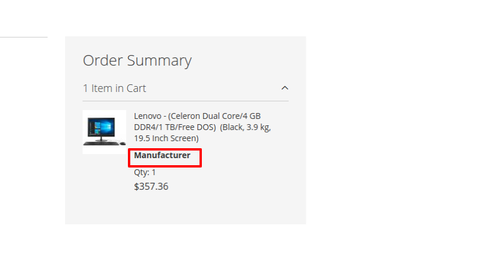

# magento2-checkoutpage-custom-product-attribute
Magento2 Checkout Page Cart Summary Custom Product Attribute


## Supports

- <b>Supports : Magento 2.0.x, 2.1.x, 2.2.x, 2.3.x and 2.4.x</b>

Required to run the following commands in Magento 2 root folder:

```
php bin/magento setup:upgrade
php bin/magento setup:static-content:deploy
php bin/magento cache:clean
```

### Install via zip

* [Download the latest version from GitHub](https://github.com/vrajeshpatel4u/magento2-checkoutpage-custom-product-attribute)

## Create Product Attribute

Create Product Attribute `manufacturer` (If exists then add value and assign in Product)

### Product Attribute In Checkout Page Cart Summary


